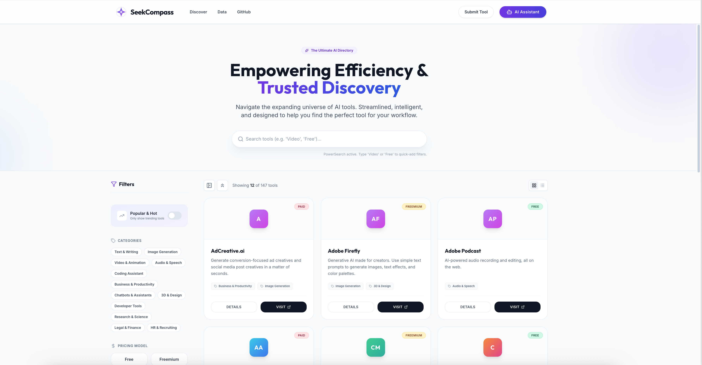

<div align="center">


# SeekCompass - AI Tool Discovery Hub

A modern, interactive platform to discover, explore, and compare the best AI tools for productivity, creativity, and business.

**[🚀 Live Demo](https://seekcompass.netlify.app)**
</div>

## Features

- **AI-Powered Discovery:** Chat with an integrated AI assistant to find the perfect tools.
- **Smart Submission:** Use AI to auto-fill tool details from a simple text paste.
- **Logo Generation:** Automatically generate professional logos for your tools using Gemini Image models.
- **Responsive Design:** Beautiful, mobile-friendly UI built with Tailwind CSS.

## Run Locally

**Prerequisites:**  Node.js (v18+)

1. **Install dependencies:**
   ```bash
   npm install
   ```

2. **Configure API Key (Optional but Recommended):**
   - Create a `.env.local` file in the root directory.
   - Add your Google Gemini API key:
     ```env
     GEMINI_API_KEY=your_key_here
     ```
   - *Note:* You can also skip this and enter your API key directly in the app's "Settings" menu (Bring Your Own Key).

3. **Run the app:**
   ```bash
   npm run dev
   ```

## Deployment

This project is configured for deployment on Netlify.

```bash
npm run build
# The 'dist' folder is ready for deployment
```